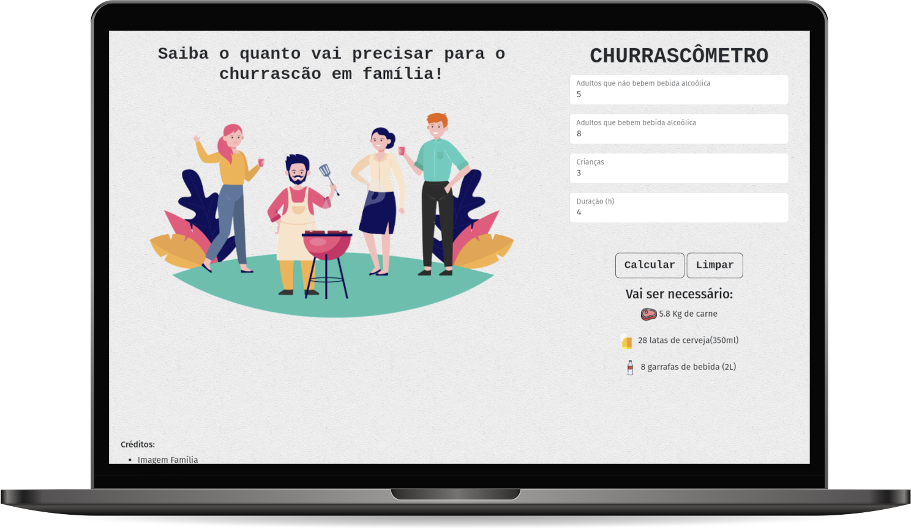

# CHURRASCÔMETRO

### Projeto desenvolvido no curso PROGRAMADOR BR

[Visualizar Página](https://gabrielmorozini.com.br/churrascometro/)

## 📚 Sobre o projeto 

Sistema para calcular a quantidade de comida de bebida necessária para um churrasco com base nas informações:
 
* Carne - 400gr por pessoa + de 6horas - 650gr
* Cerveja - 1200ml por Pessoa + 6 horas - 2000ml
* Refrigerante/água - 1000ml por pessoa + 6 horas 1500ml
* Crianças valem por 0,5.

## 🖥️ Tecnologias utilizadas

* HTML
* CSS
* JavaScript
* BootStrap

## ✒️ Licença
Esse projeto está sob licença MIT. Leia o arquivo <a href="./license" >LICENSE</a> para mais detalhes. 

  

  
  
     

